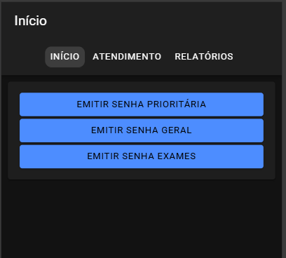

# Sistema de Controle de Atendimento - Projeto Senhas

Este projeto é um sistema de gerenciamento de atendimento via senhas, desenvolvido em **Ionic** com backend em **Node.js** e banco de dados **MySQL**.  
A solução foi criada para organizar o fluxo de atendimento de clientes em laboratórios médicos, priorizando filas de acordo com o tipo de atendimento.

---

## 📱 Telas do Aplicativo

Aqui estão algumas telas do aplicativo:

### 1. Tela de Geração de Senhas
Interface onde o cliente escolhe o tipo de atendimento (Prioritária, Geral ou Exames) e gera uma nova senha.



### 2. Tela de Atendimento
Interface para atendentes chamarem as próximas senhas disponíveis de acordo com as regras de prioridade.


---

## ✅ Requisitos para rodar o projeto

### Backend
- Node.js (versão 18.x ou superior)
- MySQL 8.0
- Editor de código (Visual Studio Code recomendado)
- Postman ou Insomnia (para testar APIs opcionalmente)

### Frontend
- Ionic CLI (`npm install -g @ionic/cli`)
- Navegador web atualizado (Chrome ou Edge)

---

## ⚙️ Como rodar o projeto

1.  Clone este repositório:
    ```bash
    git clone [https://github.com/Jotta2k4/Estudos-Ionic.git](https://github.com/Jotta2k4/Estudos-Ionic.git)
    cd Estudos-Ionic/projeto_senhas
    ```
2.  Instale as dependências do projeto:
    ```bash
    npm install
    # ou
    yarn install
    ```
3.  Execute o aplicativo no seu navegador para desenvolvimento:
    ```bash
    ionic serve
    ```
    Isso iniciará um servidor de desenvolvimento e abrirá o aplicativo em seu navegador.

Para executar em um emulador ou dispositivo real, você precisará configurar o ambiente de desenvolvimento para Android e/ou iOS e usar os comandos apropriados do Ionic CLI (como `ionic cordova run android` ou `ionic cordova run ios`).

